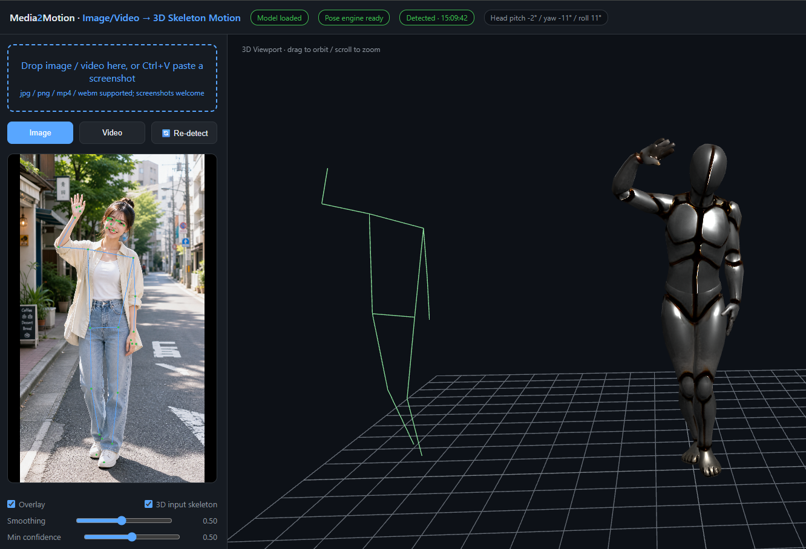
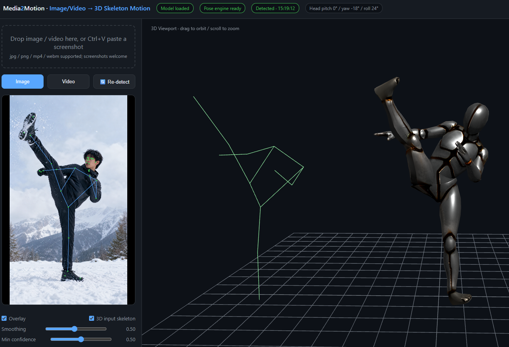
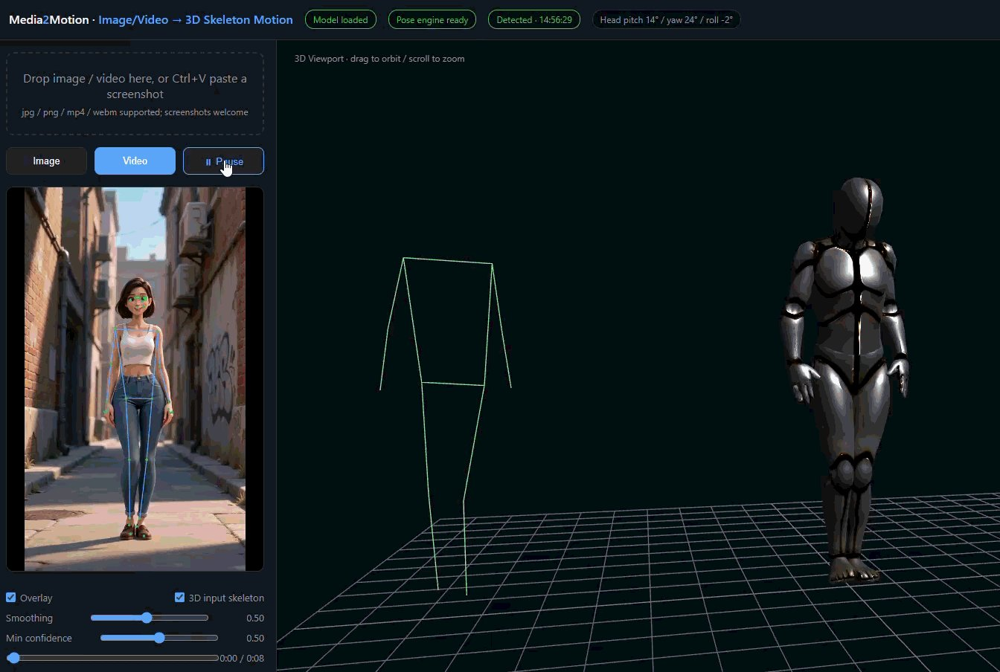

<div align="center">

# Media2Motion

**Image / Video → 3D Skeleton Motion**

Drive a rigged 3D humanoid from a photo or video — fully in your browser, fully offline.

[中文说明](README.zh-CN.md)

| Image-driven | Image-driven |
| --- | --- |
|  |  |



</div>

## What is this

Upload an **image or video**, and [MediaPipe Pose](https://developers.google.com/mediapipe) detects 33 body landmarks. A real-time driver maps them onto a **Mixamo-named humanoid skeleton** rendered with [three.js](https://threejs.org). The 3D character mirrors the pose — head pitch/yaw/roll, arms, wrists, feet, all driven.

All dependencies (JS libraries, MediaPipe model files) are bundled in this repo. **Runs fully locally.**

## Features

- **Image / video input** --- multiple formats supported
- **Video seek bar** --- draggable; auto-pauses while dragging and detects the frame you land on
- **Metric 3D pose** --- uses `poseWorldLandmarks` (meter-scale 3D world coordinates), not the much noisier 2D normalized points
- **Head pose estimation** --- live pitch / yaw / roll readout, solved from facial landmarks (nose / eyes / ears)
- **Re-detect button + confidence threshold slider** --- re-run detection on the current frame, tune sensitivity
- **Smoothing** --- exponential smoothing for video input
- **Debug skeleton** --- optional 3D overlay of the raw MediaPipe skeleton next to the model

## Quick start

Any static file server works. From the repo root:

```bash
python -m http.server 8344
# open http://localhost:8344
```

> A local server is required — browsers don't allow WASM/worker loading over `file://`.

## Use your own model

**GLB models only.** If your model is in FBX or another format, convert it first.

The bundled `model/character.glb` uses standard **Mixamo bone naming** (`Hips`, `Spine`, `LeftArm`, `LeftForeArm`, `LeftHand`, `LeftUpLeg`, …), and any rigged model with the same names works out of the box.  
FBX → GLB (Blender ≥ 4.x):

```bash
blender --background --python convert.py -- input.fbx model/character.glb
```

Notes:

- A missing `mixamorig:` prefix is fine — the driver matches by suffix
- Fingers are not driven: the bundled model has no finger bones, and fine-grained finger landmarks are too noisy — so hands rotate as a whole
- After conversion, always verify the model size is correct. Some FBX exports carry non-uniform scale on the mesh, which breaks naive bounding-box normalization entirely; this repo normalizes from bone world positions instead.

## How the driver works

```
image/video ─▶ MediaPipe Pose ─▶ poseWorldLandmarks (33 × meter-scale 3D)
                                     │
                                     ▼
                     (x, -y, -z) → character space (hip-centered)
                                     │
                                     ▼
              per-bone minimal-rotation alignment: for each chain segment,
              q_local = q_parentWorld⁻¹ ∘ q_align(restDir → targetDir) ∘ q_current
                                     │
                                     ▼
                     SkinnedMesh (three.js GLTFLoader)
```

Key implementation details (pitfalls every naive implementation hits):

1. **Use world landmarks, not normalized landmarks.** Normalized `z` is "depth × image width" — extremely noisy. World landmarks are metric and hip-centered, far more stable.
2. **Left-multiply the alignment quaternion by the bone's *current* world rotation**, then convert back to parent space: `local = parentWorld⁻¹ ∘ qAlign ∘ currentWorld`. Skip the `currentWorld` term and, on rigs whose bind pose contains roll (e.g. `Hips` with a built-in 90° Y-rotation), the whole limb chain flips 180°.
3. **Reset to bind pose each frame**, drive top-down (parent before child), re-measuring child world directions as you go.

Landmark → bone mapping:

| MediaPipe landmarks | Skeleton chain |
| --- | --- |
| shoulders 11/12 → elbows 13/14 | `Spine`, `Neck` |
| elbows → wrists 15/16 → index(19)/pinky(17/18/20) root | `Left/Right Arm → ForeArm → Hand` |
| nose 0, eyes 2/5, ears 7/8 | `Head` (independent orientation) |
| hips 23/24 → knees 25/26 → ankles 27/28 | `Left/Right UpLeg → Leg` |
| heel 29/30 → foot index 31/32 | `Left/Right Foot` |

## Limitations

- Monocular 2D-input pose estimation: depth is inferred, not measured — forward/backward motions (arm reaching toward the camera) are approximate
- **Non-full-body poses are poorly recognized** — for half-body / partially visible subjects, unseen limbs are hallucinated by the model, and the corresponding bone poses may be wrong
- Wrists are oriented only, with no twist applied (the Pose model has just 3 coarse hand landmarks — twist is too noisy); palm orientation is not controllable
- No finger articulation

## Project structure

```
├── index.html            # UI
├── i18n.js               # zh/en dictionary + switcher
├── main.js               # pose driver: landmarks → bone rotations
├── convert.py            # Blender headless FBX → GLB converter
├── model/character.glb   # bundled demo character (Mixamo naming)
├── libs/
│   ├── three.min.js      # three.js r128 (local copy)
│   ├── GLTFLoader.js
│   └── pose/             # MediaPipe Pose 0.5.x (wasm + tflite, local copy)
└── docs/
```

## Credits

- [MediaPipe Pose](https://developers.google.com/mediapipe) (Google, Apache-2.0) — pose estimation
- [three.js](https://threejs.org) (MIT) — rendering
- [MP2MM / Anim (Nor-s)](https://github.com/Nor-s/Anim) — inspiration for the world-landmarks data source

## License

MIT
